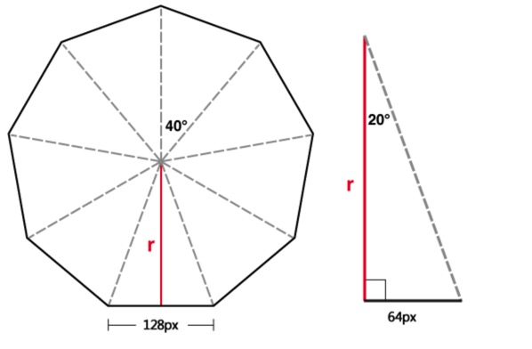

# CSS3实现3D 轮播图   [demo](http://liujuping.github.io/2017IFE/carousel/index.html)

## 原生插件：carousel

### 参数说明

@params options {Object} carousel参数对象

@params options.el {String} 父元素的id值

@params options.type {String} 展示的类型（目前只有图片） "imgs"

@params options.imgs {Array} 轮播的图片的地址

### 使用方法

html 引用插件相关文件
```html
<head>
  ...
  <link rel="stylesheet" href="carousel.css">
</head>
<body>
<div id="carousel"></div>
</body>
<script src="carousel.js"></script>
<script src="app.js"></script>
</html>
```
app.js 使用插件
```javascript
new Carousel({
  el: "carousel",
  type: "img",
  imgs: ['imgs/1.jpg', 'imgs/2.jpg']
})
```
### 设计思路
1、初始化一个舞台，这个舞台就是之后旋转的对象

```
<div id="carousel">
  <div id="carousel-stage">
  </div>
</div>
```

2、在舞台里面增加图片元素，图片层叠到一起，设置position: absolute

3、给每个图片旋转一定的角度，角度的计算值：(rotate = 360 / imgs.length)

4、这时候图片是重叠到一起的，我们要分开它们，只需要所有图片都往前移动一段距离



这时候只要计算r值就好了，（r = img.width / 2 / Math.tan( rotate / 360 * Math.PI)）

5、让舞台旋转起来就好了，每次旋转的角度是rotate

6、把功能抽出来，就实现了一个简单的轮播插件了！

### 参考链接

[好吧，CSS3 3D transform变换，不过如此！](http://www.zhangxinxu.com/wordpress/2012/09/css3-3d-transform-perspective-animate-transition/)

